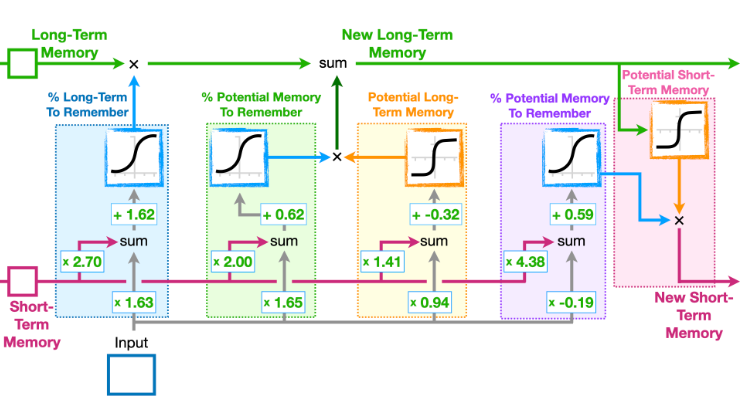
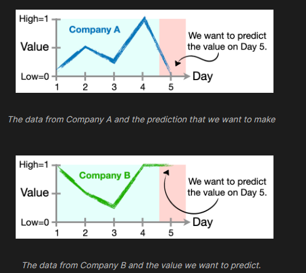

# Custom LSTM Implementation in PyTorch

This repository contains a PyTorch implementation of an LSTM (Long Short-Term Memory) network designed from scratch. The implementation includes detailed setup of the LSTM gates and training procedures, demonstrating a basic understanding of LSTM mechanics.




## Installation

Ensure you have PyTorch installed in your environment. You can install PyTorch by running:
```
pip install torch
```

## LSTM by Hand Class

The `LSTMbyHand` class implements an LSTM network with customizable input and hidden sizes. It defines four gates: forget, input, state, and output gates, each parameterized with weights and biases.

### Initialization
- **Input Size:** Size of the input features.
- **Hidden Size:** Size of the hidden and cell state.

Parameters are initialized using a normal distribution for weights and zeros for biases.

### Forward Pass
Processes input through the LSTM gates and updates the hidden and cell states:
- **Forget Gate:** Decides which information to discard from the cell state.
- **Input Gate:** Updates the cell state with new information.
- **State Gate:** Generates new candidate values for the state.
- **Output Gate:** Determines the next hidden state.

### Training
Trains the model using the Adam optimizer:
- **Loss Calculation:** Mean squared error between the predicted and actual values.
- **Backpropagation:** Adjusts the weights to minimize the loss.

### Prediction
Generates output predictions from the trained model using provided inputs.

## Example Usage




```python
input_size = 4  
hidden_size = 1
lstm = LSTMbyHand(input_size, hidden_size)

# Load data
batches = dataLoader()

# Train the model
lstm.train_model(batches, max_epoch=50000)

# Make a prediction
print(round(lstm.predict(torch.tensor([0.0, 0.5, 0.25, 1.0]))[0].item(), 3))
```

## Note
This implementation is for educational purposes and may require adjustments for production-level projects.
